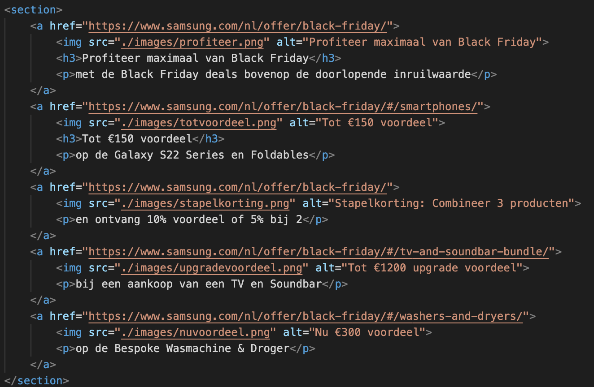
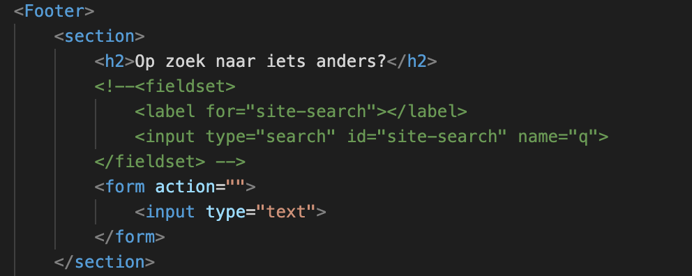

# Procesverslag
Markdown is een simpele manier om HTML te schrijven.  
Markdown cheat cheet: [Hulp bij het schrijven van Markdown](https://github.com/adam-p/markdown-here/wiki/Markdown-Cheatsheet).

Nb. De standaardstructuur en de spartaanse opmaak van de README.md zijn helemaal prima. Het gaat om de inhoud van je procesverslag. Besteedt de tijd voor pracht en praal aan je website.

Nb. Door *open* toe te voegen aan een *details* element kun je deze standaard open zetten. Fijn om dat steeds voor de relevante stuk(ken) te doen.

## Jij

  
uitwerken voor kick-off werkgroep

  ### Auteur:
  Maryam Qadri

  #### Je startniveau:
  Blauwe 

  #### Je focus:
  Responsive
 

## Je website

  
uitwerken voor kick-off werkgroep

  ### Je opdracht:
  https://www.samsung.com/nl/

  #### Screenshot(s) van de eerste pagina (small screen): 
  Home page  
  

  #### Screenshot(s) van de tweede pagina (small screen):
  Offer page 
  
 

## Toegankelijkheidstest 1/2 (week 1)

smansung.nl getest door splinter

  
uitwerken na test in 1e werkgroep

  ### Bevindingen

  website is erg overzichtelijk en goed te gebruiken zonder beperkingen.

  #### Screenreader

  je hoort pas wat een knop doet nadat je hem hebt ingedrukt

  alles wordt in een taal verteld terwijl er in zowel nederlands als engels talige teksten op de website staan

  er wordt verteld in welke tab je zit maar niet er wordt vaak niet verteld waar de tap over gaat.

  een oplossing zou kunnen zijn om te vertellen waar de knop over gaat wanneer de gebruiker er over heen hoverd.

  alleen de h1 en welke tab aangeven bij hoveren op tap.

  #### Muis en Toetsenbord

  elementen worden in een logische volgorde geselecteerd en het is altijd goed zichtbaar doormiddel van een zwarte puntjes outline om de elementen die geselecteerd zijn.

  wanneer je op spatie klikt mag de website net iets verder naar beneden zodat die beter op het volgende blok valt zodat je elke keer alle informatie op de juiste plek hebt.

  #### Motoriek (shocks, elastiekjes)

  website is even goed te gebruiken met een visuele beperking

  

  website is bijna niet te bedienen met sepasmes grotendeels door de kleine knoppen maar dit geld alleen voor de web versie.

  website functioneerd redelijk terwijl je een ballon hoog houdt het is alleen lasitg lezen door de afleiding.

  #### Visueel (brillen, contrast, kleurenblind, dark/light).

  de website blijft volledig te gebruiken in elke kleur modus en er komen geen beperkingen bij door verandering van bepaalde kleuren.

  geen dark mode mogelijk.

## Breakdownschets (week 1)

  
uitwerken na afloop 2e werkgroep

  ### de hele pagina: 
  

  ### dynamisch deel: 
  

## Voortgang 1 (week 2)

  
uitwerken voor 1e voortgang

  
  ### Stand van zaken
  hier dit ging goed & dit was lastig (neem ook screenshots op van delen van je website en code)
  
  Dit ging goed:
  
  
  
  Hier heb ik wat moeite mee. Ik weet niet welke ik moet gebruiken en hoe ik verder moet.
  

  ### Agenda voor meeting
  samen met je groepje opstellen

  | Elisa          | Giannina           | Pauline      | Zakaria          |
  | ---            | ---                | ---          | ---              |
  | dit bespreken  | en dit             | verschillende kleuren in een tekst    | en dan ik dat    |
  | en dat ook nog | dit als er tijd is | links vormgeven | dit wil ik zeker |
  | ...            | ...                | afbeeldingen knippen         | ...              |

  ### Verslag van meeting
  hier na afloop snel de uitkomsten van de meeting vastleggen

  - punt 1
  - punt 2
  - nog een punt
  - ...

## Voortgang 2 (week 3)

  
uitwerken voor 2e voortgang

  ### Stand van zaken
  hier dit ging goed & dit was lastig (neem ook screenshots op van delen van je website en code)

  ### Agenda voor meeting
  samen met je groepje opstellen

  | student 1      | student 2          | student 3    | student 4        |
  | ---            | ---                | ---          | ---              |
  | dit bespreken  | en dit             | en ik dit    | en dan ik dat    |
  | en dat ook nog | dit als er tijd is | nog een punt | dit wil ik zeker |
  | ...            | ...                | ...          | ...              |

  ### Verslag van meeting
  hier na afloop snel de uitkomsten van de meeting vastleggen

  - punt 1
  - punt 2
  - nog een punt
- ...

## Toegankelijkheidstest 2/2 (week 4)

  
uitwerken na test in 8e werkgroep

  ### Bevindingen
  Lijst met je bevindingen die in de test naar voren kwamen (geef ook aan wat er verbeterd is):

  #### Screenreader
  Hier korte omschrijving (met indien nodig afbeeldingen)

  Hier een omschrijving van hoe het opgelost kan worden (met indien nodig afbeeldingen)

  #### Muis en Toetsenbord 
  Hier korte omschrijving (met indien nodig afbeeldingen)

  Hier een omschrijving van hoe het opgelost kan worden (met indien nodig afbeeldingen)

  #### Motoriek (shocks, elastiekjes)
  Hier korte omschrijving (met indien nodig afbeeldingen)

  Hier een omschrijving van hoe het opgelost kan worden (met indien nodig afbeeldingen)

  #### Visueel (brillen, contrast, kleurenblind, dark/light). 
  Hier korte omschrijving (met indien nodig afbeeldingen)

  Hier een omschrijving van hoe het opgelost kan worden (met indien nodig afbeeldingen)

## Voortgang 3 (week 4)

  
uitwerken voor 3e voortgang

  ### Stand van zaken
  hier dit ging goed & dit was lastig (neem ook screenshots op van delen van je website en code)

  ### Agenda voor meeting
  samen met je groepje opstellen

  | student 1      | student 2          | student 3    | student 4        |
  | ---            | ---                | ---          | ---              |
  | dit bespreken  | en dit             | en ik dit    | en dan ik dat    |
  | en dat ook nog | dit als er tijd is | nog een punt | dit wil ik zeker |
  | ...            | ...                | ...          | ...              |

  ### Verslag van meeting
  hier na afloop snel de uitkomsten van de meeting vastleggen

  - punt 1
  - punt 2
  - nog een punt
  - ...

## Eindgesprek (week 5)

  
uitwerken voor eindgesprek

  ### Je uitkomst - karakteristiek screenshots:
  

  ### Dit ging goed/Heb ik geleerd: 
  Korte omschrijving met plaatjes

  

  ### Dit was lastig/Is niet gelukt:
  Korte omschrijving met plaatjes

  

## Bronnenlijst

  
continu bijhouden terwijl je werkt

  Nb. Wees specifiek ('css-tricks' als bron is bijv. niet specifiek genoeg).

  1. bron 1
  2. bron 2
  3. ...

